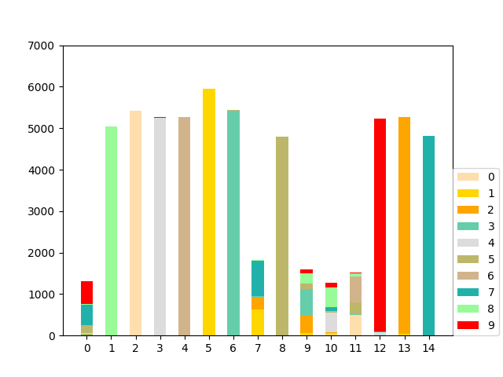

# Unsupervised Image Generation with Infinite Generative Adversarial Networks

Here is the implementation of MICGANs using DCGAN architecture on MNIST dataset with jittor.

### Install Requirements

+ jittor
+ packages in requirements.txt

### Training


You can train the model by using the following command:

```
bash Scripts/mnist.sh
```

The above training is under the configs in './configs/default.yaml'.

### Visualization

During training, for the better understanding of CRP sampling procedure, we visualize the classification results of the real images on each state of the CRP sampling procedure. And the visulization results are in the 'output/mnist/crp/mode_label', 'output/mnist/crp/sorted_mode_label' and 'output/mnist/crp/label_mode'.

The images in the 'mode_label' are like the following:



In the image, the x-axis is the mode id, the y-axis is the number of the real images classified to the mode, and the color represents the ground-truth label. Images in the 'sorted_mode_label' shows the sorted results. For images in the 'label_mode', the x-axis the ground-truth label, and the color represents mode id.

### Notes

+ The CRP sampling procedure is at its core Markov Chain Monte Carlo (MCMC) sampling. Other than plotting the likelihood, another good way to see if it has mixed is to plot out the clustering results as the above image. Also, since it is MCMC, different samples could give slightly different results even after it mixes.


## Citations
Please consider citing our paper in your publications if the project helps your research. BibTeX reference is as follows.
```
@inproceedings{ying2021unsupervised,
  title={Unsupervised Image Generation with Infinite Generative Adversarial Networks},
  author={Ying, Hui and Wang, He and Shao, Tianjia and Yang, Yin and Zhou, Kun},
  booktitle={Proceedings of the IEEE/CVF International Conference on Computer Vision},
  pages={14284--14293},
  year={2021}
}
```
